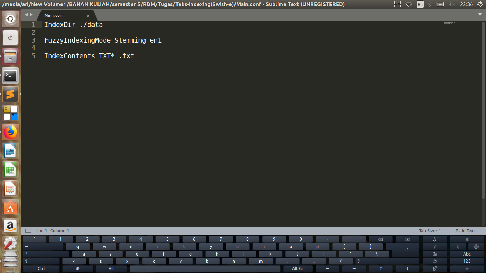
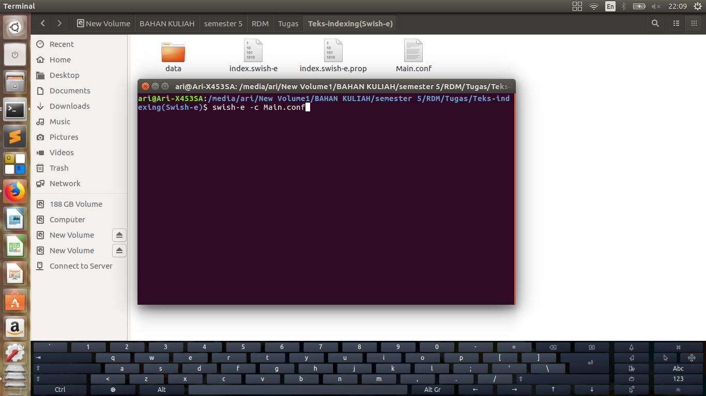
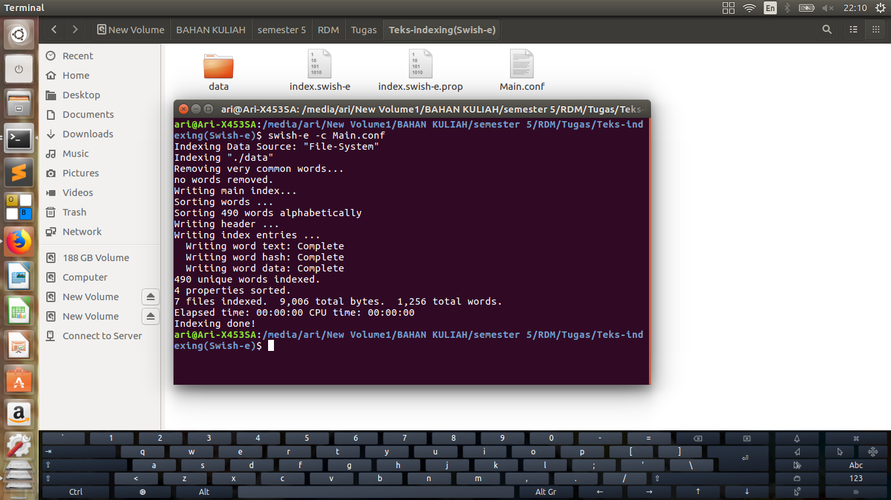
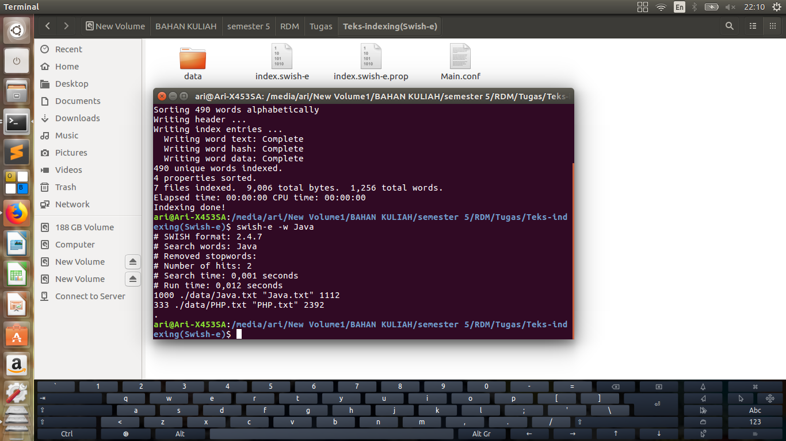
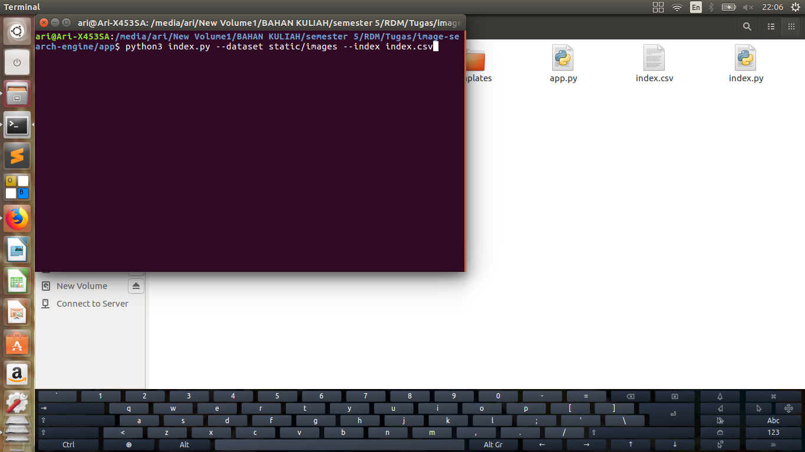
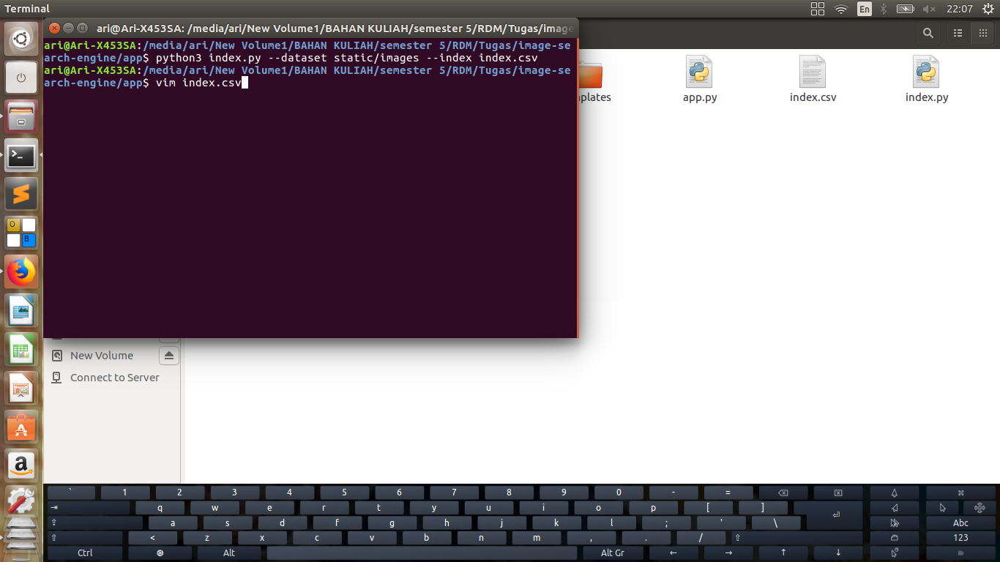
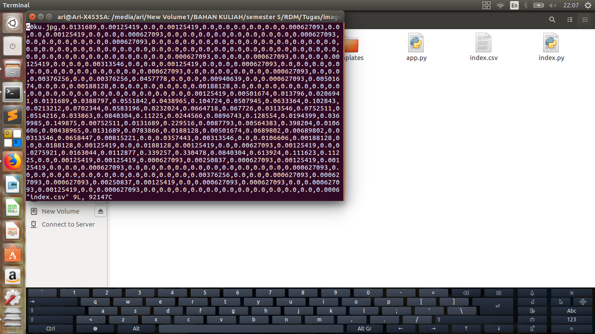
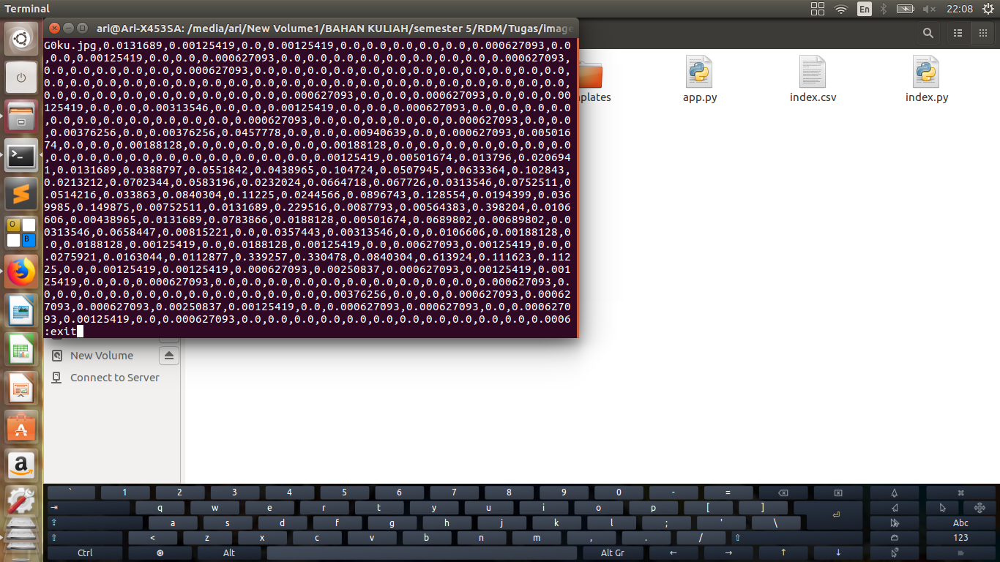

# ProjectRDM2019

## Text-indexing : Swish-e (Package on Ubuntu)
### a. Requirements :
#### Instal swish-e jika belum ada

$ sudo apt-get install swish-e

### b. Proses-proses dalam menjalankan Program :
1. Buat folder Teks-indexing(Swish-e)

2. Masuk ke dalam folder Teks-indexing(Swish-e)

$ cd Teks-indexing(Swish-e)

3. Buat folder data

4. Masuk ke dalam folder data

$ cd data

5. Masukan file yang sudah di siapkan untuk di index ke dalam folder data

6. Buat file Main.conf sebagai program utama yang akan di jalankan

7. Di dalam file Main.conf isi dengan

$ IndexDir ./data

$ FuzzyIndexingMode Stemming_en1

$ IndexContents TXT* .txt

8. Jalankan $ swish-e -c Main.conf

9.Barulah kemudian jalankan, misalnya kata yang akan di cari adalah Java 

$ swish-e -w [kata yang ingin di cari] 

## Image-search-engine
### a. Requirements :
#### Instal python3-pip jika belum ada

$ sudo apt install python3-pip

### b. Proses-proses dalam menjalankan Program :
1. Sebelum memulai clone ke dalam satu folder

$ git clone https://github.com/kudeh/image-search-engine.git

2. Masuk ke dalam folder

$ cd image-search-engine/

atau masuk ke dalam folder image-search-engine -> klik kanan -> open in terminal

3. Jika belum pernah menginstal pip, maka instal dulu

$ sudo apt-get install python3-pip

4. Kemudian instal requirements.txt

$ pip3 install -r requirements.txt

5. Kemudian masuk ke folder app

$ cd app

6.Kemudian jalankan 

$ python index.py --dataset static/images --index index.csv 

7. Setelah itu untuk melihat output yang didapat dari index.cvs jalankan

$ vim index.csv

Hasilnya:

untuk keluar tekan :exit kemudian enter

8. Jika ingin mencoba dengan foto yang berbeda,ganti gambarpada folder static/images

9. Jalankan kembali step 6 sampai dengan 7

## Source :
* Text-Indexing: Swish-e (Package on Ubuntu)
* Image-Indexing: https://github.com/kudeh/image-search-engine.
